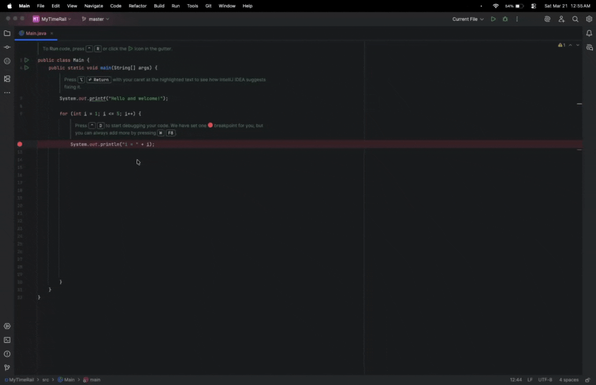

# TimeRail

> A visual code history plugin for IntelliJ IDEA — scroll through your coding timeline and restore any past state with one click.

## What it does

TimeRail runs quietly in the background while you code. Every time your caret moves to a new line and you make an edit, it automatically captures a full screenshot of your editor and saves a complete snapshot of the file content at that moment.

When you want to review your history, click **Open** to bring up a translucent overlay panel (75% of your IDE window) showing a horizontally scrollable timeline of all your snapshots. Each card displays a visual preview of the editor and the timestamp it was captured. Click any card to instantly restore your file to that exact state.

## Features

- **Automatic snapshot capture** — triggered by line changes, not every keystroke (with 200ms debounce to avoid noise)
- **Visual timeline UI** — translucent horizontal scrollable overlay rendered directly inside IntelliJ
- **One-click restore** — click any snapshot card to rewrite the file back to that saved state
- **Editor screenshots** — each snapshot includes a live rendered preview of the editor at that moment
- **Lightweight controls** — Start / Stop / Clear / Open from a sidebar tool window

## Demo



## Tech Stack

- **Kotlin**
- **IntelliJ Platform SDK**
- **Gradle (Kotlin DSL)**
- **Swing / JBPopup** for the overlay UI

## Getting Started

1. Clone the repo
2. Open in IntelliJ IDEA
3. Run the Gradle `runIde` task to launch a sandboxed IDE instance with the plugin loaded
4. Open any file, click **Start Recording** in the TimeRail tool window, and start coding
5. Click **Open** to view your history timeline

```bash
./gradlew runIde
```

## Project Structure

```
src/
└── main/
    ├── kotlin/com/timerail/timerail/
    │   └── TimeRailToolWindowFactory.kt   # Core plugin logic
    └── resources/META-INF/
        ├── plugin.xml                     # Plugin registration
        └── pluginIcon.svg                 # Plugin icon
```

## Author

**Dexter (Yulin) Peng**
Computer Science, University of Minnesota Twin Cities
[GitHub](https://github.com/DexterPeng117)
